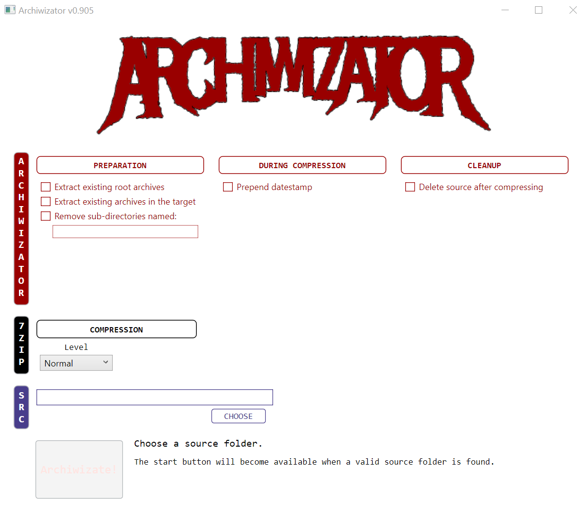

<!--
  GitHub repository template (b210103)
  https://github.com/APrettyCoolProgram/my-development-environment/tree/master/templates/github/
-->

***

<h3 align="center">

  &gt;&gt; WARNING &lt;&lt; 
  THIS IS BETA SOFTWARE! 
  USE AT YOUR OWN RISK!

  

</h3>

***

<h3 align="center">

  
   
  A totally metal GUI for 7-Zip
   

</h3>

<h3 align="left">

  &nbsp;&nbsp;
  &nbsp;
  &nbsp;
  &nbsp;
  &nbsp;
   
  &nbsp;&nbsp;
  &nbsp;
  &nbsp;

</h3>

<h1 align="center">

  
   

</h1>

<h1 align="center">

  &nbsp;-&nbsp;
 
  [MANUAL](src/Resources/Doc/Manual/archiwizator-manual.md)&nbsp;&bull;&nbsp;[CHANGELOG](src/Resources/Doc/archiwizator-changelog.md)&nbsp;&bull;&nbsp;[ROADMAP](src/Resources/Doc/archiwizator-roadmap.md)&nbsp;&bull;&nbsp;[KNOWN ISSUES](src/Resources/Doc/archiwizator-known-issues.md)&nbsp;&bull;&nbsp;[SUPPORT](src/Resources/Doc/archiwizator-support.md)
   

</h1>

<!-- The HTML indentations have to stay this way to work. -->
<table>
<tr>
<td img src="RepositoryData/Asset/Image/Document/README/spacer.png" alt="blank-spacer" width="1000" height="1">

  ### CONTENTS
  [ABOUT](#about) 
  [GETTING STARTED](#getting-started) 
  [INSTALLING](#installing) 
  [SETUP](#setup) 
  [USING](#using) 
  [COMPILING](#compiling) 
  [TESTING](#testing) 
  [API](#api) 
  [DEVELOPMENT](#development) 
  [ADDITIONAL INFORMATION](#additional-information) 

</td>
</tr>
</table>

# ABOUT
Archiwizator is a Graphical User Interface (GUI) front-end for [7-Zip](https://www.7-zip.org/).

**Archiwizator v1.0 is pretty rough! It works, but it's a bit wonky. Use at your own risk!** 

### Features
* Batch archiving
* Datestamp postfixes

# GETTING STARTED

### Before you begin
Please note that while v1.0 of Archiwizator works, it's not pretty and is not feature-complete.

### Prerequisites
* Prerequisite #1
* Prerequisite #2
* Prerequisite #3

# INSTALLING

### Windows
1. The steps to install the project in Windows
2. Use both Markdown and/or HTML
3. Include screenshots when possible.

### MacOS
1. The steps to install the project in MacOS
2. Use both Markdown and/or HTML
3. Include screenshots when possible.

### Linux
1. The steps to install the project in Linux
2. Use both Markdown and/or HTML
3. Include screenshots when possible.

### Other operating systems
1. The steps to install the project in other operating systems
2. Use both Markdown and/or HTML
3. Include screenshots when possible.
4. If other operating systems are not supported, mention that here.

# SETUP
If your project has a setup procedure, document it here.

For example, you may need to make changes to a configuration file before using the project.

### Configuring
Configuration introduction.

#### Required configuration settings
Required configuration settings go here.

#### Recommended configuration settings
Recommended configuration settings go here.

#### Optional configuration settings
Optional configuration settings go here.

### Important notes about options
Optional/important notes about options go here.

# USING
Usage instructions go here.

# UPDATING
Updating instructions go here

# UNINSTALLING
Instructions for uninstalling go here.

# COMPILING
Compling information blurb goes here.

### Making
Making instructions go here.

### Building
Building instructions go here.

### Deploying
Deployment instructions go here.

# TESTING
Testing instructions go here.

# HOW IT WORKS
Sometimes it's fun to let users know how the magic happens.

# API
If your project contains an API, it should be documented here (or link to the documentation).

# FAQ

### Are you nice?
I think so.

# DEVELOPMENT
A blurb about development can go here.

* [Project homepage](https://github.com/github-account/archiwizator)
* [Changelog](src/Resources/Doc/archiwizator-changelog.md)
* [Roadmap](src/Resources/Doc/archiwizator-roadmap.md)
* [Known issues](src/Resources/Doc/archiwizator-known-issues.md)
* [Support](src/Resources/Doc/archiwizator-support.md)
* [Testing](src/Resources/Doc/archiwizator-testing.md)
* [Built with](src/Resources/Doc/archiwizator-built-with.md)
* [Contributors](src/Resources/Doc/archiwizator-contributors.md)
* [Acknowledgements](src/Resources/Doc/archiwizator-acknowledgements.md)
* [Notices](src/Resources/Doc/archiwizator-third-party-notices.md)
* [Related projects](src/Resources/Doc/archiwizator-related-projects.md)
* [Additional reading](src/Resources/Doc/archiwizator-additional-reading.md)

### Contributing
If you are interested in contributing to this project, please see our:
* [Code of conduct](src/Resources/Doc/archiwizator-code-of-conduct.md)
* [Contributing guidelines](src/Resources/Doc/archiwizator-contributing.md)
* [Testing procedures](src/Resources/Doc/archiwizator-testing.md)
* [Issue template](src/Resources/Doc/archiwizator-issue-template.md)
* [Pull request template](src/Resources/Doc/archiwizator-pull-request-template.md)

### Repository

* [Issues](https://github.com/aprettycoolprogram/Archiwizator/issues)
* [Pull request](https://github.com/aprettycoolprogram/Archiwizator/pulls)
* [Projects](https://github.com/aprettycoolprogram/Archiwizator/projects)
* [Wiki](https://github.com/aprettycoolprogram/Archiwizator/wiki)
* [Insights](https://github.com/aprettycoolprogram/Archiwizator/pulse)

***

<h3 align="left">

  &nbsp;
  &nbsp;
  &nbsp;
  

</h3>

<!-- DEVELOPMENT FOOTER -->
&nbsp;&nbsp;&nbsp;&nbsp; 

