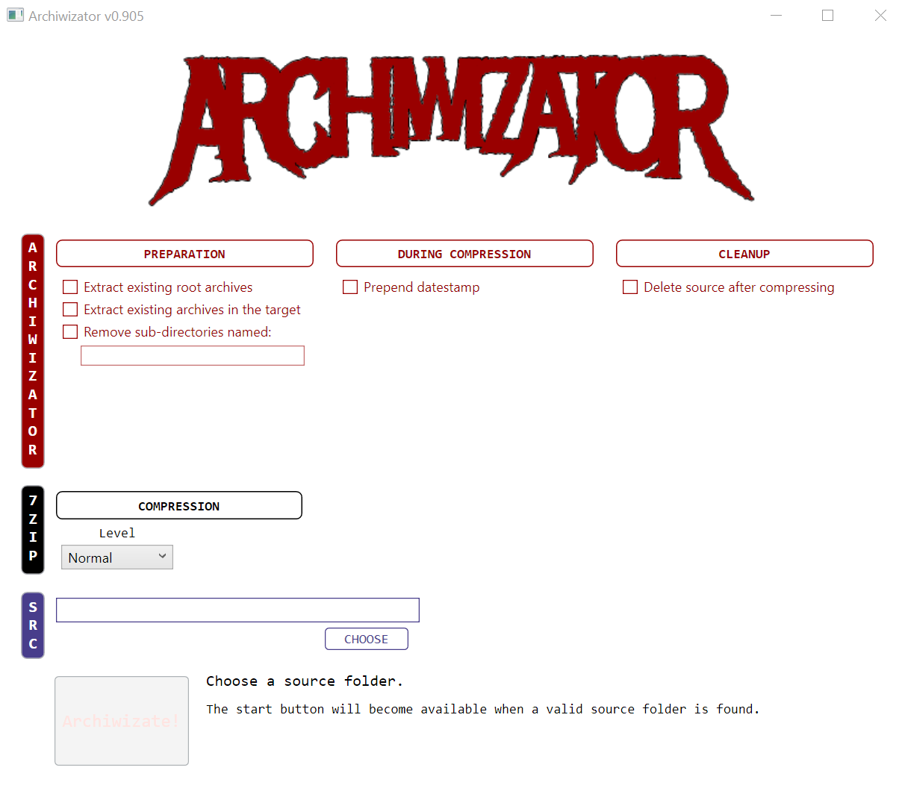

<!-- 260824 -->

***

> [!WARNING]  
> This project is archived, and no longer maintained.  
>  
> [Peazip](https://peazip.github.io/) does this sort of stuff better anyway.

***

<h1 align="center">

  
   
  A 7-Zip GUI
   

</h1>

<h3 align="center">

  &nbsp;
  &nbsp;
  &nbsp;

</h3>

<h4 align="center">

  
   

</h4>

> Archiwizator has been depreciated, and most of the functionality/code has been moved to [Woolpack](https://github.com/APrettyCoolProgram/woolpack).
