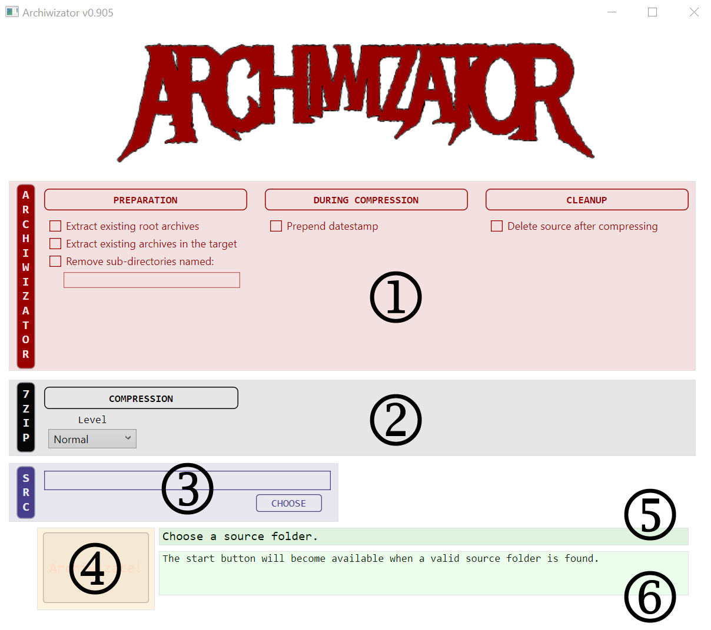

<!--
  Software manual template (b210104)
  https://github.com/APrettyCoolProgram/my-development-environment/tree/master/templates/documentation
-->

<h1 align="center">

  
  <br>
  MANUAL
  <br>

</h1>

<h4 align="center">

  Archiwizator v0.905-beta&nbsp;&bull;&nbsp;Last updated January 4, 2021

</h4>

***

# ARCHIWIZATOR

### What
Archiwizator is a GUI for 7-Zip.

### Why
I couldn't find anything that did this.

### How
Uses [7-Zip](URL)

# THE MAIN WINDOW
When Archiwizator starts, you the main window will be displayed:

<h3 align="center">

  

</h3>

The main window is comprised of:

1. [Archiwizator options](#archiwizator-options)
2. [7-Zip options](#7zip-options)
3. [Source options](#source-options)
4. [The Archiwizate button](#the-archiwizate-button)
5. [Progress overview display](#progress-overview-display)
6. [Progress details display](#progress-details-display)

# ARCHIWIZATOR OPTIONS
Archiwizator options are divided into three categories:

## Preparation

### Extract existing root directories
Extracts all archive files in the source directory, then deletes the original archive files.

Enable this option if there are archive files in the source directory that you want to re-archive using Archiwizator.

EXAMPLE
The following archives:
```
../SourcePath/compressed-file-01.zip
../SourcePath/compressed-file-02.zip
..
```
would be extracted to individual sub-directories:
```
../SourcePath/compressed-file-01/
../SourcePath/compressed-file-02/
..
```
The newly created sub-directories would then be archived by Archiwizator.

NOTES
- Only .zip files will be extracted.


#### Extract existing archives in the target

#### Remove sub-directories named

### During compression

### Cleanup
