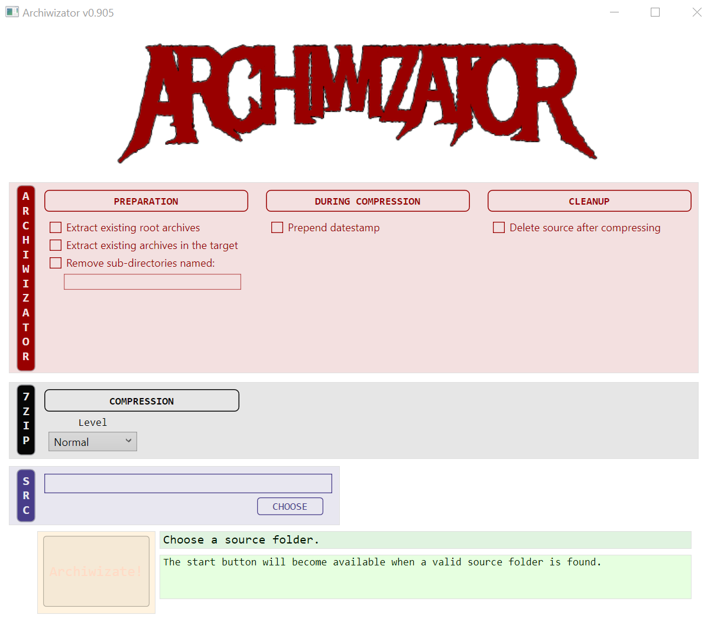

<!--
  Software manual template (b210104)
  https://github.com/APrettyCoolProgram/my-development-environment/tree/master/templates/documentation
-->

<h1 align="center">

  
   
  MANUAL
   

</h1>

<h4 align="center">

  Archiwizator v0.905-beta&nbsp;&bull;&nbsp;Last updated January 4, 2021

</h4>

***

## The main Archiwizinator window

<h3 align="center">

  
   
  1.
  2.
  3.
   

</h3>

